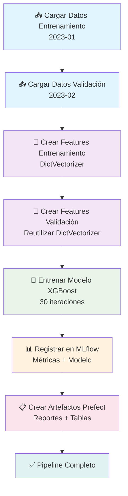

# 🚕 Pipeline de Predicción de Duración de Taxis NYC

Un pipeline completo de Machine Learning usando **Prefect** para orquestación y **MLflow** para tracking de experimentos. Predice cuánto tiempo durará un viaje de taxi en Nueva York.

## 🎯 Objetivo del Pipeline

Crear un modelo que prediga la **duración en minutos** de un viaje de taxi basándose en:

- 📍 Ubicaciones de recogida y destino
- 📏 Distancia del viaje
- 📅 Datos históricos de NYC

## 🔄 Flujo del Pipeline



## 📊 Arquitectura de Tareas

### 🔹 Task 1: `load_data`

- **Input**: Año y mes
- **Proceso**: Descarga parquet desde S3, limpia datos, calcula duración
- **Output**: DataFrame procesado
- **Artefactos**: Tabla resumen de datos

### 🔹 Task 2: `create_features`

- **Input**: DataFrame + DictVectorizer (opcional)
- **Proceso**: Codifica ubicaciones, incluye distancia
- **Output**: Matriz de features + DictVectorizer entrenado
- **Artefactos**: Información de features

### 🔹 Task 3: `train_model`

- **Input**: Features de train/val + targets
- **Proceso**: Entrena XGBoost, evalúa RMSE
- **Output**: MLflow run ID
- **Artefactos**: Métricas, modelo, preprocessor

## 🚀 Cómo ejecutar (3 pasos simples)

### Paso 1: Instalar dependencias

```bash
# Ir al directorio del proyecto
cd /Users/mdurango/University/MLOps

# Instalar todo lo necesario
uv sync
```

### Paso 2: Iniciar Prefect (en otra terminal)

**🖥️ Terminal 1 - Prefect:**

```bash
cd /Users/mdurango/University/MLOps/03-Orchestrarion/Prefect-pipelines
uv run prefect server start
```

*Deja esta terminal corriendo - verás logs de Prefect aquí*

- [ ]  Paso 3: Ejecutar el pipeline (en nueva terminal)

**🖥️ Terminal 2 - Pipeline:**

```bash
cd /Users/mdurango/University/MLOps/03-Orchestrarion/Prefect-pipelines

# Configurar Prefect: para añadir variable de enterno
uv run prefect config set PREFECT_API_URL=http://127.0.0.1:4200/api

# Ejecutar con datos por defecto (2023, enero)
uv run python duration_prediction_prefect.py

# O con otros datos
uv run python duration_prediction_prefect.py --year 2023 --month 3
```

## ✅ ¿Funcionó?

Si todo salió bien, deberías ver:

```text
✅ Pipeline completed successfully!
📊 MLflow run_id: 7f1af75a05854e9f804c346333102a97
🔗 View results at: sqlite:///mlflow.db
```

## 📁 Outputs del Pipeline

Después de ejecutar el pipeline tendrás:

### 📂 Archivos Generados

```
models/
├── preprocessor.b          # DictVectorizer serializado (pickle)
mlflow.db                   # Base de datos SQLite con experimentos
prefect_run_id.txt         # ID del último run para referencia
```

### 📊 Artefactos en Prefect

- **📈 data-summary-YYYY-MM**: Estadísticas de datos cargados
- **🔧 feature-info**: Dimensiones de matriz de features
- **🎯 model-performance**: Tabla con RMSE y hiperparámetros
- **📝 training-summary**: Reporte markdown detallado
- **📋 pipeline-summary**: Resumen completo de ejecución

### 🗃️ Registros en MLflow

- **Experimento**: `nyc-taxi-experiment-prefect`
- **Métricas**: RMSE (~5.2 minutos)
- **Parámetros**: Hiperparámetros de XGBoost
- **Artefactos**: Modelo XGBoost + Preprocessor
- **Tags**: Información de run automática

## 👀 Ver Resultados

### 🖥️ Dashboard de Prefect

```bash
# Abrir en navegador
open http://127.0.0.1:4200
```

**Qué verás:**

- 📊 Flow runs con estado (Success/Failed)
- ⏱️ Duración de cada task
- 📋 Artefactos generados (tablas y reportes)
- 🔍 Logs detallados de cada paso

### 🧪 Interface de MLflow

```bash
# Iniciar UI de MLflow
uv run mlflow ui --backend-store-uri sqlite:///mlflow.db
# Abrir http://127.0.0.1:5000
```

**Qué verás:**

- 📈 Comparación de experimentos
- 📊 Métricas (RMSE) por run
- 🔧 Hiperparámetros utilizados
- 💾 Modelos registrados y versionados

## 🛠️ Si algo no funciona

**Error: "No Prefect API URL provided"**

```bash
# Asegúrate de que Prefect esté corriendo
uv run prefect server start &
uv run prefect config set PREFECT_API_URL=http://127.0.0.1:4200/api
```

**Error: "Connection refused"**

- Espera unos segundos después de iniciar Prefect
- El pipeline usa SQLite automáticamente si MLflow no está disponible

**Error: "Module not found"**

```bash
# Instala las dependencias
cd /Users/mdurango/University/MLOps
uv sync
```

## 🎯 Detalles Técnicos del Pipeline

### 📊 Datos Utilizados

- **Fuente**: NYC Taxi & Limousine Commission
- **Tipo**: Green taxi trips (parquet)
- **Entrenamiento**: 2023-01 (~68K registros)
- **Validación**: 2023-02 (~65K registros)
- **URL**: `https://d37ci6vzurychx.cloudfront.net/trip-data/`

### 🔧 Feature Engineering

```python
# Características creadas:
- duration = dropoff_time - pickup_time (target)
- PU_DO = pickup_location + '_' + dropoff_location
- trip_distance (numérica)

# Filtros aplicados:
- 1 ≤ duration ≤ 60 minutos
- Eliminación de outliers
```

### 🤖 Modelo XGBoost

```python
# Hiperparámetros optimizados:
params = {
    'learning_rate': 0.096,
    'max_depth': 30,
    'min_child_weight': 1.06,
    'reg_alpha': 0.018,
    'reg_lambda': 0.012,
    'objective': 'reg:squarederror'
}
# Iteraciones: 30 con early stopping
```

### 📈 Métricas Esperadas

- **RMSE Validación**: ~5.2-5.3 minutos
- **Features**: ~5,700 (combinaciones PU_DO)
- **Tiempo Entrenamiento**: ~30 segundos
- **Tamaño Modelo**: ~2MB

## 🔄 Flujo de Datos Detallado

```
📥 NYC Taxi Data (Parquet)
    ↓ [Filtros + Feature Engineering]
🔧 Features Matrix (Sparse)
    ↓ [DictVectorizer]
🎯 Training Data (65K samples)
    ↓ [XGBoost Training]
🤖 Trained Model
    ↓ [MLflow Logging]
📊 Experiment Tracking
    ↓ [Prefect Artifacts]
📋 Pipeline Reports
```

## 🛠️ Configuración Avanzada

### Parámetros del Pipeline

```bash
# Cambiar período de datos
uv run python duration_prediction_prefect.py --year 2023 --month 6

# Usar servidor MLflow externo
uv run python duration_prediction_prefect.py --mlflow-uri http://mlflow-server:5000
```

### Variables de Entorno

```bash
# MLflow tracking
export MLFLOW_TRACKING_URI="sqlite:///mlflow.db"

# Prefect API
export PREFECT_API_URL="http://127.0.0.1:4201/api"
```

## 💡 Tips para Estudiantes

1. **🔍 Explora los artefactos** en Prefect - muestran estadísticas útiles
2. **📊 Compara experimentos** en MLflow - prueba diferentes meses
3. **⚡ El pipeline es robusto** - maneja errores automáticamente
4. **🔄 Es idempotente** - puedes ejecutarlo múltiples veces
5. **📈 Observa el RMSE** - menor es mejor (objetivo < 6 minutos)

Si se te presenta problemas con el port, usa lsof -i :--port

## 🛑 Detener Todo

### Detener Prefect Server

```bash
# Encontrar y matar proceso Prefect
pkill -f "prefect server"

# O si sabes el PID específico
ps aux | grep "prefect server"
kill [PID]
```

### Detener MLflow (si lo iniciaste)

```bash
# Si iniciaste MLflow UI
pkill -f "mlflow ui"
```

## 🔄 Ver Resultados Más Tarde

### Iniciar solo para ver dashboards (sin ejecutar pipeline)

**Ver experimentos en MLflow:**

```bash
cd /Users/mdurango/University/MLOps/03-Orchestrarion/Prefect-pipelines

# Iniciar MLflow UI para ver experimentos guardados
uv run mlflow ui --backend-store-uri sqlite:///mlflow.db --port 5000

# Abrir en navegador: http://127.0.0.1:5000
```

**Ver runs anteriores en Prefect:**

```bash
# Iniciar Prefect server
uv run prefect server start --port 4201

# Configurar (si no está configurado)
uv run prefect config set PREFECT_API_URL=http://127.0.0.1:4201/api

# Abrir en navegador: http://127.0.0.1:4201
```

### Archivos que siempre están disponibles

```bash
# Ver archivos generados
ls -la models/          # preprocessor.b
ls -la mlflow.db        # base de datos experimentos
cat prefect_run_id.txt  # último run ID
```

## 💡 Tips para Estudiantes

1. **🔍 Explora los artefactos** en Prefect - muestran estadísticas útiles
2. **📊 Compara experimentos** en MLflow - prueba diferentes meses
3. **⚡ El pipeline es robusto** - maneja errores automáticamente
4. **🔄 Es idempotente** - puedes ejecutarlo múltiples veces
5. **📈 Observa el RMSE** - menor es mejor (objetivo < 6 minutos)
6. **💾 Los resultados se guardan** - puedes verlos más tarde sin re-ejecutar

*¿Problemas? El pipeline debería funcionar sin issues. Verifica que Prefect esté corriendo y tengas internet para descargar datos.*
