```mermaid
graph TD
    A[📊 Data Lake/Warehouse] --> B[🔄 Scheduler<br/>Cron/Airflow]
    B --> C[🤖 ML Model<br/>Batch Job]
    C --> D[📈 Predictions]
    D --> E[💾 Results Storage<br/>Database/Files]
    E --> F[📋 Reports/Dashboard]

    style A fill:#e1f5fe
    style B fill:#f3e5f5
    style C fill:#e8f5e8
    style D fill:#fff3e0
    style E fill:#fce4ec
    style F fill:#e0f2f1
```

```mermaid
graph TD
    A[📱 Client App<br/>Web/Mobile] --> B[🌐 Load Balancer<br/>Nginx/AWS ALB]
    B --> C[🔄 API Gateway<br/>Rate Limiting]
    C --> D[🤖 ML Service<br/>Flask/FastAPI]
    D --> E[💾 Model Cache<br/>Redis/Memory]
    D --> F[📊 Monitoring<br/>Prometheus]
    E --> G[🗄️ Model Storage<br/>S3/MLflow]

    style A fill:#e1f5fe
    style B fill:#f3e5f5
    style C fill:#e8f5e8
    style D fill:#fff3e0
    style E fill:#fce4ec
    style F fill:#e0f2f1
    style G fill:#f9fbe7
```

# 🚀 Módulo 04: Deployment de Modelos ML

Una guía completa sobre las **tres estrategias principales** para desplegar modelos de Machine Learning en producción.

## 🎯 Objetivo del Módulo

Aprender a llevar modelos ML desde el desarrollo hasta producción usando diferentes estrategias según el caso de uso:

- **🔄 Batch Offline**: Predicciones programadas en lotes
- **🌐 Online Web Service**: API REST para predicciones en tiempo real
- **⚡ Online Streaming**: Procesamiento continuo de datos en tiempo real

## 📊 Comparación de Estrategias


| Aspecto             | Batch Offline | Web Service    | Streaming            |
| ------------------- | ------------- | -------------- | -------------------- |
| **⏱️ Latencia**   | Horas/Días   | Milisegundos   | Segundos             |
| **📈 Volumen**      | Alto          | Medio          | Alto                 |
| **💰 Costo**        | Bajo          | Medio          | Alto                 |
| **🔧 Complejidad**  | Baja          | Media          | Alta                 |
| **🎯 Casos de Uso** | Reportes, ETL | Apps web, APIs | IoT, Fraud detection |

## 1️⃣ Batch Offline Deployment

### 🔍 ¿Qué es?

Procesamiento de **grandes volúmenes de datos** de forma programada, generalmente durante horas de baja actividad.

### 🏗️ Arquitectura



### 💡 Casos de Uso Ideales

- **📊 Predicción de duración** para toda la flota de taxis
- **💰 Estimación de tarifas** para planificación de rutas
- **📈 Análisis de patrones** de tráfico por zonas
- **🔍 Optimización de rutas** basada en datos históricos
- **📧 Reportes operacionales** para compañías de taxi

### ⚙️ Flujo de Trabajo



```mermaid
sequenceDiagram
    participant S as 🕐 Scheduler
    participant D as 📊 Data Source
    participant M as 🤖 ML Model
    participant DB as 💾 Database
    participant R as 📋 Reports

    S->>D: 1. Extract data (daily/weekly)
    D->>M: 2. Load batch data
    M->>M: 3. Run predictions
    M->>DB: 4. Store results
    DB->>R: 5. Generate reports
    R->>S: 6. Send notifications
```

### 🛠️ Tecnologías Comunes

```python
# Ejemplo con Apache Airflow - Predicción de Duración de Taxis NYC
from airflow import DAG
from airflow.operators.python_operator import PythonOperator
import pandas as pd
import joblib
import numpy as np
from datetime import datetime, timedelta

def batch_taxi_duration_prediction():
    # Cargar modelo entrenado (del pipeline de Prefect)
    model = joblib.load('/models/taxi_duration_model.pkl')
    preprocessor = joblib.load('/models/preprocessor.b')

    # Cargar datos de viajes programados para mañana
    tomorrow = datetime.now() + timedelta(days=1)
    query = f"""
    SELECT trip_id, PULocationID, DOLocationID, trip_distance,
           pickup_datetime, passenger_count
    FROM scheduled_trips
    WHERE DATE(pickup_datetime) = '{tomorrow.date()}'
    """
    trips_data = pd.read_sql(query, connection)

    # Preparar features (mismo formato que en entrenamiento)
    trips_data['PU_DO'] = trips_data['PULocationID'].astype(str) + '_' + \
                         trips_data['DOLocationID'].astype(str)

    # Crear features usando el mismo preprocessor
    feature_dicts = trips_data[['PU_DO', 'trip_distance']].to_dict('records')
    X = preprocessor.transform(feature_dicts)

    # Predicciones de duración en minutos
    duration_predictions = model.predict(X)

    # Guardar resultados para planificación operacional
    results = pd.DataFrame({
        'trip_id': trips_data['trip_id'],
        'predicted_duration_minutes': duration_predictions,
        'estimated_fare': duration_predictions * 2.5,  # $2.5 por minuto
        'prediction_date': datetime.now(),
        'scheduled_pickup': trips_data['pickup_datetime']
    })

    # Guardar en base de datos para dashboard operacional
    results.to_sql('daily_trip_predictions', connection, if_exists='replace')

    print(f"Processed {len(results)} trip predictions for {tomorrow.date()}")
    print(f"Average predicted duration: {duration_predictions.mean():.1f} minutes")

# DAG para predicciones diarias
default_args = {
    'owner': 'mlops-team',
    'depends_on_past': False,
    'start_date': datetime(2023, 1, 1),
    'retries': 2,
    'retry_delay': timedelta(minutes=5)
}

dag = DAG(
    'taxi_duration_batch_prediction',
    default_args=default_args,
    description='Daily batch prediction for NYC taxi trip durations',
    schedule_interval='0 2 * * *',  # 2 AM daily
    catchup=False
)

predict_task = PythonOperator(
    task_id='predict_taxi_durations',
    python_callable=batch_taxi_duration_prediction,
    dag=dag
)
```

### ✅ Ventajas

- **💰 Costo eficiente** para grandes volúmenes
- **🔧 Implementación simple**
- **📊 Ideal para análisis históricos**
- **⚡ Optimización de recursos**

### ❌ Desventajas

- **⏳ Alta latencia** (horas/días)
- **🚫 No tiempo real**
- **📅 Dependiente de horarios**

## 2️⃣ Online Web Service Deployment

### 🔍 ¿Qué es?

**API REST** que recibe requests individuales y devuelve predicciones en **tiempo real** (milisegundos).

### 🏗️ Arquitectura



### 💡 Casos de Uso Ideales

- **🚕 Estimación de duración** en apps de taxi
- **💰 Cálculo de tarifas** dinámicas en tiempo real
- **🗺️ Optimización de rutas** para conductores
- **📱 Apps móviles** de transporte
- **🎯 Asignación inteligente** conductor-pasajero

### ⚙️ Flujo de Trabajo



```mermaid
sequenceDiagram
    participant C as 📱 Client
    participant API as 🌐 API Gateway
    participant ML as 🤖 ML Service
    participant Cache as 💾 Cache
    participant DB as 🗄️ Database

    C->>API: 1. POST /predict
    API->>ML: 2. Forward request
    ML->>Cache: 3. Check model cache
    Cache->>ML: 4. Return cached model
    ML->>ML: 5. Run prediction
    ML->>DB: 6. Log request (async)
    ML->>API: 7. Return prediction
    API->>C: 8. JSON response
```

### 🛠️ Implementación con FastAPI

```python
from fastapi import FastAPI, HTTPException
from pydantic import BaseModel, Field
import joblib
import numpy as np
from typing import Optional
import redis
import time
from datetime import datetime
import logging

# Configurar logging
logging.basicConfig(level=logging.INFO)
logger = logging.getLogger(__name__)

app = FastAPI(
    title="NYC Taxi Duration Prediction API",
    description="API REST para predecir la duración de viajes de taxi en NYC usando XGBoost",
    version="1.0.0",
    docs_url="/docs",
    redoc_url="/redoc"
)

# Cliente Redis para métricas y caché
redis_client = redis.Redis(host='localhost', port=6379, db=0)

class TaxiTripRequest(BaseModel):
    """
    Modelo de request para predicción de duración de viaje de taxi.

    Attributes:
        pickup_location_id (int): ID de la zona de recogida (1-263 para NYC)
        dropoff_location_id (int): ID de la zona de destino (1-263 para NYC)
        trip_distance (float): Distancia del viaje en millas
        passenger_count (int, optional): Número de pasajeros. Por defecto 1
        pickup_datetime (str, optional): Fecha/hora de recogida en formato ISO

    Example:
        {
            "pickup_location_id": 161,
            "dropoff_location_id": 236,
            "trip_distance": 2.5,
            "passenger_count": 2,
            "pickup_datetime": "2023-01-15T14:30:00"
        }
    """
    pickup_location_id: int = Field(
        ...,
        ge=1,
        le=263,
        description="ID de zona de recogida (1-263)"
    )
    dropoff_location_id: int = Field(
        ...,
        ge=1,
        le=263,
        description="ID de zona de destino (1-263)"
    )
    trip_distance: float = Field(
        ...,
        gt=0,
        le=100,
        description="Distancia del viaje en millas"
    )
    passenger_count: Optional[int] = Field(
        1,
        ge=1,
        le=6,
        description="Número de pasajeros"
    )
    pickup_datetime: Optional[str] = Field(
        None,
        description="Fecha/hora de recogida (ISO format)"
    )

class TaxiTripResponse(BaseModel):
    """
    Modelo de response con la predicción de duración del viaje.

    Attributes:
        predicted_duration_minutes (float): Duración predicha en minutos
        estimated_fare (float): Tarifa estimada en USD
        confidence_score (float): Score de confianza (0.0-1.0)
        pickup_location (int): ID de zona de recogida
        dropoff_location (int): ID de zona de destino
        trip_distance (float): Distancia del viaje
        model_version (str): Versión del modelo usado
        response_time_ms (int): Tiempo de respuesta en milisegundos
        prediction_timestamp (str): Timestamp de la predicción
    """
    predicted_duration_minutes: float = Field(
        ...,
        description="Duración predicha del viaje en minutos"
    )
    estimated_fare: float = Field(
        ...,
        description="Tarifa estimada en USD"
    )
    confidence_score: float = Field(
        ...,
        ge=0.0,
        le=1.0,
        description="Score de confianza de la predicción"
    )
    pickup_location: int = Field(..., description="ID de zona de recogida")
    dropoff_location: int = Field(..., description="ID de zona de destino")
    trip_distance: float = Field(..., description="Distancia del viaje en millas")
    model_version: str = Field(..., description="Versión del modelo")
    response_time_ms: int = Field(..., description="Tiempo de respuesta en ms")
    prediction_timestamp: str = Field(..., description="Timestamp ISO de predicción")

# Variables globales para modelo y preprocessor
model = None
preprocessor = None

@app.on_event("startup")
async def load_models():
    """
    Carga el modelo XGBoost y el preprocessor DictVectorizer al iniciar la aplicación.

    Raises:
        Exception: Si hay error cargando los modelos desde disco
    """
    global model, preprocessor
    try:
        logger.info("🔄 Cargando modelos...")
        model = joblib.load('/models/taxi_duration_model.pkl')
        preprocessor = joblib.load('/models/preprocessor.b')
        logger.info("✅ Modelos cargados exitosamente")

        # Verificar que los modelos funcionan
        test_features = preprocessor.transform([{'PU_DO': '161_236', 'trip_distance': 2.5}])
        test_prediction = model.predict(test_features)
        logger.info(f"🧪 Test de modelo exitoso: {test_prediction[0]:.2f} minutos")

    except Exception as e:
        logger.error(f"❌ Error cargando modelos: {e}")
        raise e

def calculate_confidence_score(trip_distance: float, pickup_id: int, dropoff_id: int) -> float:
    """
    Calcula un score de confianza para la predicción basado en características del viaje.

    Args:
        trip_distance (float): Distancia del viaje en millas
        pickup_id (int): ID de zona de recogida
        dropoff_id (int): ID de zona de destino

    Returns:
        float: Score de confianza entre 0.6 y 0.95

    Note:
        - Viajes muy largos (>50 millas) tienen menor confianza
        - Zonas conocidas (Manhattan central) tienen mayor confianza
    """
    # Base confidence
    confidence = 0.85

    # Penalizar viajes muy largos
    if trip_distance > 50:
        confidence -= 0.2
    elif trip_distance > 20:
        confidence -= 0.1

    # Bonus para zonas centrales de Manhattan (IDs comunes)
    manhattan_zones = [161, 236, 237, 238, 239, 140, 141, 142, 143]
    if pickup_id in manhattan_zones and dropoff_id in manhattan_zones:
        confidence += 0.1

    # Asegurar rango válido
    return round(max(0.6, min(0.95, confidence)), 3)

def calculate_estimated_fare(duration_minutes: float, trip_distance: float) -> float:
    """
    Calcula la tarifa estimada basada en duración y distancia.

    Args:
        duration_minutes (float): Duración predicha en minutos
        trip_distance (float): Distancia en millas

    Returns:
        float: Tarifa estimada en USD

    Note:
        Fórmula: $2.50 base + $0.50/minuto + $2.50/milla + impuestos
    """
    base_fare = 2.50
    per_minute_rate = 0.50
    per_mile_rate = 2.50
    tax_rate = 0.50  # Impuesto fijo

    fare = base_fare + (duration_minutes * per_minute_rate) + (trip_distance * per_mile_rate) + tax_rate
    return round(fare, 2)

@app.post("/predict-duration", response_model=TaxiTripResponse)
async def predict_taxi_duration(request: TaxiTripRequest):
    """
    Predice la duración de un viaje de taxi en NYC.

    Args:
        request (TaxiTripRequest): Datos del viaje a predecir

    Returns:
        TaxiTripResponse: Predicción con duración, tarifa y metadatos

    Raises:
        HTTPException: Error 500 si falla la predicción

    Example:
        POST /predict-duration
        {
            "pickup_location_id": 161,
            "dropoff_location_id": 236,
            "trip_distance": 2.5
        }

        Response:
        {
            "predicted_duration_minutes": 12.34,
            "estimated_fare": 8.75,
            "confidence_score": 0.85,
            ...
        }
    """
    try:
        start_time = time.time()
        logger.info(f"🚕 Predicción solicitada: {request.pickup_location_id} -> {request.dropoff_location_id}")

        # Crear feature PU_DO (mismo formato que en entrenamiento)
        pu_do = f"{request.pickup_location_id}_{request.dropoff_location_id}"

        # Preparar features para el modelo
        feature_dict = {
            'PU_DO': pu_do,
            'trip_distance': request.trip_distance
        }

        # Transformar usando el mismo preprocessor del entrenamiento
        X = preprocessor.transform([feature_dict])

        # Predicción de duración en minutos
        duration_minutes = model.predict(X)[0]

        # Calcular tarifa estimada usando función dedicada
        estimated_fare = calculate_estimated_fare(duration_minutes, request.trip_distance)

        # Calcular confidence score
        confidence = calculate_confidence_score(
            request.trip_distance,
            request.pickup_location_id,
            request.dropoff_location_id
        )

        response_time = int((time.time() - start_time) * 1000)

        # Métricas para monitoreo (async)
        redis_client.incr("taxi_predictions_count")
        redis_client.incr(f"predictions_location_{request.pickup_location_id}")
        redis_client.lpush("recent_predictions", f"{duration_minutes:.2f}")
        redis_client.ltrim("recent_predictions", 0, 99)  # Mantener últimas 100

        logger.info(f"✅ Predicción completada: {duration_minutes:.2f} min, ${estimated_fare}")

        return TaxiTripResponse(
            predicted_duration_minutes=round(float(duration_minutes), 2),
            estimated_fare=estimated_fare,
            confidence_score=confidence,
            pickup_location=request.pickup_location_id,
            dropoff_location=request.dropoff_location_id,
            trip_distance=request.trip_distance,
            model_version="v1.0",
            response_time_ms=response_time,
            prediction_timestamp=datetime.utcnow().isoformat()
        )

    except Exception as e:
        logger.error(f"❌ Error en predicción: {str(e)}")
        raise HTTPException(status_code=500, detail=f"Error en predicción: {str(e)}")

@app.get("/health")
async def health_check():
    """
    Endpoint de health check para verificar el estado del servicio.

    Returns:
        dict: Estado del servicio, modelos cargados y métricas básicas

    Example:
        GET /health

        Response:
        {
            "status": "healthy",
            "model_loaded": true,
            "preprocessor_loaded": true,
            "total_predictions": 1234,
            "uptime_seconds": 3600
        }
    """
    try:
        total_predictions = redis_client.get("taxi_predictions_count")
        total_predictions = int(total_predictions) if total_predictions else 0

        return {
            "status": "healthy",
            "model_loaded": model is not None,
            "preprocessor_loaded": preprocessor is not None,
            "total_predictions": total_predictions,
            "redis_connected": redis_client.ping(),
            "timestamp": datetime.utcnow().isoformat()
        }
    except Exception as e:
        logger.error(f"❌ Health check failed: {e}")
        return {
            "status": "unhealthy",
            "error": str(e),
            "timestamp": datetime.utcnow().isoformat()
        }

@app.get("/model-info")
async def model_info():
    """
    Información detallada sobre el modelo ML en uso.

    Returns:
        dict: Metadatos del modelo, features, datos de entrenamiento y performance

    Example:
        GET /model-info

        Response:
        {
            "model_type": "XGBoost Regressor",
            "target": "trip_duration_minutes",
            "features": ["PU_DO", "trip_distance"],
            "training_data": "NYC Taxi 2023-01, 2023-02",
            "expected_rmse": "~5.2 minutes",
            "version": "v1.0"
        }
    """
    return {
        "model_type": "XGBoost Regressor",
        "target": "trip_duration_minutes",
        "features": ["PU_DO", "trip_distance"],
        "feature_count": "~5700 location pairs",
        "training_data": "NYC Taxi 2023-01 (train), 2023-02 (validation)",
        "training_samples": "~133K trips",
        "expected_rmse": "~5.2 minutes",
        "model_size": "~2MB",
        "version": "v1.0",
        "last_updated": "2023-03-01",
        "preprocessing": "DictVectorizer for categorical encoding"
    }

@app.get("/metrics")
async def get_metrics():
    """
    Métricas operacionales del servicio.

    Returns:
        dict: Métricas de uso, performance y estadísticas de predicciones
    """
    try:
        total_predictions = redis_client.get("taxi_predictions_count")
        total_predictions = int(total_predictions) if total_predictions else 0

        # Obtener últimas predicciones para estadísticas
        recent_predictions = redis_client.lrange("recent_predictions", 0, -1)
        recent_durations = [float(p.decode()) for p in recent_predictions]

        avg_duration = sum(recent_durations) / len(recent_durations) if recent_durations else 0

        return {
            "total_predictions": total_predictions,
            "recent_predictions_count": len(recent_durations),
            "avg_predicted_duration_minutes": round(avg_duration, 2),
            "min_duration": round(min(recent_durations), 2) if recent_durations else 0,
            "max_duration": round(max(recent_durations), 2) if recent_durations else 0,
            "timestamp": datetime.utcnow().isoformat()
        }
    except Exception as e:
        logger.error(f"❌ Error getting metrics: {e}")
        return {"error": str(e)}
```

### 🐳 Containerización con Docker

```dockerfile
FROM python:3.9-slim

WORKDIR /app

COPY requirements.txt .
RUN pip install -r requirements.txt

COPY . .

EXPOSE 8000

CMD ["uvicorn", "main:app", "--host", "0.0.0.0", "--port", "8000"]
```

### ☸️ Deployment con Kubernetes

```yaml
apiVersion: apps/v1
kind: Deployment
metadata:
  name: ml-api
spec:
  replicas: 3
  selector:
    matchLabels:
      app: ml-api
  template:
    metadata:
      labels:
        app: ml-api
    spec:
      containers:
      - name: ml-api
        image: ml-api:latest
        ports:
        - containerPort: 8000
        resources:
          requests:
            memory: "512Mi"
            cpu: "250m"
          limits:
            memory: "1Gi"
            cpu: "500m"
---
apiVersion: v1
kind: Service
metadata:
  name: ml-api-service
spec:
  selector:
    app: ml-api
  ports:
  - port: 80
    targetPort: 8000
  type: LoadBalancer
```

### ✅ Ventajas

- **⚡ Baja latencia** (< 100ms)
- **🔄 Tiempo real**
- **📈 Escalable horizontalmente**
- **🔧 Fácil integración** con apps

### ❌ Desventajas

- **💰 Más costoso** que batch
- **🔧 Mayor complejidad** operacional
- **📊 Requiere monitoreo** constante

## 3️⃣ Online Streaming Deployment

### 🔍 ¿Qué es?

Procesamiento **continuo** de flujos de datos en tiempo real, ideal para eventos que requieren **respuesta inmediata**.

### 🏗️ Arquitectura


### 💡 Casos de Uso Ideales

- **🚕 Ajuste dinámico de tarifas** en tiempo real
- **📊 Monitoreo de tráfico** y congestión
- **🎯 Asignación inteligente** conductor-pasajero
- **🗺️ Optimización de rutas** en vivo
- **📈 Predicción de demanda** por zona
- **🚦 Gestión de flota** en tiempo real

### ⚙️ Flujo de Trabajo



```mermaid
sequenceDiagram
    participant S as 📡 Data Source
    participant K as 📨 Kafka
    participant P as ⚡ Processor
    participant ML as 🤖 ML Model
    participant A as 🚨 Alerts
    participant DB as 💾 Storage

    S->>K: 1. Stream events
    K->>P: 2. Consume messages
    P->>ML: 3. Feature extraction
    ML->>ML: 4. Real-time prediction
    ML->>A: 5. Trigger alerts (if needed)
    ML->>DB: 6. Store results
    P->>K: 7. Produce enriched events
```

### 🛠️ Implementación con Kafka Streams

```python
from kafka import KafkaConsumer, KafkaProducer
import json
import joblib
import numpy as np
from datetime import datetime
import logging

class TaxiDurationStreamProcessor:
    def __init__(self):
        # Cargar modelo y preprocessor entrenados
        self.model = joblib.load('/models/taxi_duration_model.pkl')
        self.preprocessor = joblib.load('/models/preprocessor.b')

        # Configurar Kafka consumer para viajes en tiempo real
        self.consumer = KafkaConsumer(
            'taxi_trip_requests',
            bootstrap_servers=['localhost:9092'],
            value_deserializer=lambda x: json.loads(x.decode('utf-8'))
        )

        # Producer para enviar predicciones
        self.producer = KafkaProducer(
            bootstrap_servers=['localhost:9092'],
            value_serializer=lambda x: json.dumps(x).encode('utf-8')
        )

        logging.basicConfig(level=logging.INFO)
        self.logger = logging.getLogger(__name__)

    def extract_features(self, trip_request):
        """Extrae features del request de viaje"""
        # Crear PU_DO feature (mismo formato que entrenamiento)
        pu_do = f"{trip_request['pickup_location_id']}_{trip_request['dropoff_location_id']}"

        feature_dict = {
            'PU_DO': pu_do,
            'trip_distance': trip_request['trip_distance']
        }

        # Usar el mismo preprocessor del entrenamiento
        return self.preprocessor.transform([feature_dict])

    def calculate_dynamic_fare(self, duration_minutes, base_distance, surge_multiplier=1.0):
        """Calcula tarifa dinámica basada en duración predicha"""
        base_fare = 2.5
        per_minute_rate = 0.5
        per_mile_rate = 2.0

        fare = (base_fare +
                (duration_minutes * per_minute_rate) +
                (base_distance * per_mile_rate)) * surge_multiplier

        return round(fare, 2)

    def process_stream(self):
        """Procesa el stream de requests de taxi en tiempo real"""
        self.logger.info("🚕 Starting taxi duration stream processor...")

        for message in self.consumer:
            try:
                trip_request = message.value
                start_time = datetime.utcnow()

                # Extraer features
                features = self.extract_features(trip_request)

                # Predicción de duración
                predicted_duration = self.model.predict(features)[0]

                # Determinar si es viaje largo (>30 min) para alertas
                is_long_trip = predicted_duration > 30

                # Calcular tarifa dinámica
                surge_multiplier = trip_request.get('surge_multiplier', 1.0)
                estimated_fare = self.calculate_dynamic_fare(
                    predicted_duration,
                    trip_request['trip_distance'],
                    surge_multiplier
                )

                # Enriquecer evento con predicción
                enriched_trip = {
                    **trip_request,
                    'predicted_duration_minutes': round(float(predicted_duration), 2),
                    'estimated_fare': estimated_fare,
                    'is_long_trip': is_long_trip,
                    'processing_time_ms': int((datetime.utcnow() - start_time).total_seconds() * 1000),
                    'prediction_timestamp': datetime.utcnow().isoformat(),
                    'model_version': 'v1.0'
                }

                # Enviar a diferentes topics según tipo de viaje
                if is_long_trip:
                    # Alertar para viajes largos (>30 min)
                    self.producer.send('long_trip_alerts', enriched_trip)
                    self.logger.warning(
                        f"LONG TRIP: {trip_request['trip_id']} - "
                        f"{predicted_duration:.1f} min predicted"
                    )

                # Enviar predicción para asignación de conductor
                self.producer.send('trip_duration_predictions', enriched_trip)

                # Log para monitoreo
                self.logger.info(
                    f"Processed trip {trip_request['trip_id']}: "
                    f"{predicted_duration:.1f} min, ${estimated_fare}"
                )

            except Exception as e:
                self.logger.error(f"Error processing trip request: {e}")
                # Enviar a topic de errores para debugging
                error_event = {
                    'original_message': message.value,
                    'error': str(e),
                    'timestamp': datetime.utcnow().isoformat()
                }
                self.producer.send('processing_errors', error_event)

# Ejecutar el stream processor
if __name__ == "__main__":
    processor = TaxiDurationStreamProcessor()
    processor.process_stream()
```

### 🔄 Apache Flink Implementation

```python
from pyflink.datastream import StreamExecutionEnvironment
from pyflink.table import StreamTableEnvironment
from pyflink.datastream.connectors import FlinkKafkaConsumer
import joblib

def fraud_detection_job():
    # Configurar entorno
    env = StreamExecutionEnvironment.get_execution_environment()
    env.set_parallelism(4)

    # Kafka source
    kafka_source = FlinkKafkaConsumer(
        topics=['transactions'],
        deserialization_schema=JsonRowDeserializationSchema.builder()
            .type_info(Types.ROW([
                Types.STRING(),  # transaction_id
                Types.DOUBLE(),  # amount
                Types.INT(),     # merchant_category
                Types.LONG()     # timestamp
            ])).build(),
        properties={'bootstrap.servers': 'localhost:9092'}
    )

    # Stream processing
    stream = env.add_source(kafka_source)

    # Aplicar modelo ML
    predictions = stream.map(lambda transaction: {
        'transaction_id': transaction[0],
        'fraud_score': predict_fraud(transaction),
        'timestamp': transaction[3]
    })

    # Sink para alertas
    predictions.filter(lambda x: x['fraud_score'] > 0.7) \
              .add_sink(kafka_fraud_alerts_sink)

    env.execute("Fraud Detection Stream")

def predict_fraud(transaction):
    # Cargar modelo (cache en memoria)
    model = get_cached_model()
    features = extract_features(transaction)
    return model.predict_proba([features])[0][1]
```

### 📊 Monitoreo y Métricas

```python
from prometheus_client import Counter, Histogram, Gauge
import time

# Métricas de monitoreo
TRIPS_PROCESSED = Counter('trips_processed_total', 'Total taxi trips processed')
LONG_TRIPS_DETECTED = Counter('long_trips_detected_total', 'Total long trips detected (>30min)')
PROCESSING_TIME = Histogram('processing_time_seconds', 'Time spent processing trip request')
AVG_PREDICTED_DURATION = Gauge('avg_predicted_duration_minutes', 'Average predicted trip duration')
MODEL_RMSE = Gauge('model_rmse', 'Current model RMSE in minutes')

def process_with_monitoring(trip_request):
    start_time = time.time()

    try:
        # Procesar request de viaje
        result = process_trip_request(trip_request)

        # Actualizar métricas
        TRIPS_PROCESSED.inc()
        if result['predicted_duration_minutes'] > 30:
            LONG_TRIPS_DETECTED.inc()

        # Actualizar duración promedio
        AVG_PREDICTED_DURATION.set(result['predicted_duration_minutes'])

    finally:
        PROCESSING_TIME.observe(time.time() - start_time)
```

### ✅ Ventajas

- **⚡ Ultra baja latencia** (milisegundos)
- **🔄 Procesamiento continuo**
- **📈 Escalabilidad masiva**
- **🎯 Respuesta inmediata** a eventos críticos

### ❌ Desventajas

- **🔧 Alta complejidad** técnica
- **💰 Costoso** de mantener
- **🛠️ Requiere expertise** especializado
- **📊 Monitoreo complejo**

## 🔄 Patrones de Deployment Híbridos

### 🎯 Lambda Architecture

Combina **batch** y **streaming** para obtener lo mejor de ambos mundos:

```mermaid
graph TD
    A[📊 Data Sources] --> B[📨 Message Queue]
    A --> C[💾 Data Lake]

    B --> D[⚡ Speed Layer<br/>Real-time Stream]
    C --> E[🔄 Batch Layer<br/>Historical Processing]

    D --> F[📈 Serving Layer<br/>Combined Results]
    E --> F

    F --> G[📱 Applications]

    style D fill:#ffebee
    style E fill:#e8f5e8
    style F fill:#fff3e0
```



### 🔄 Kappa Architecture

Solo **streaming**, pero con capacidad de reprocesar datos históricos:

```mermaid
graph TD
    A[📊 All Data as Stream] --> B[⚡ Stream Processor]
    B --> C[💾 Immutable Log]
    C --> D[📈 Materialized Views]
    D --> E[📱 Applications]

    C --> F[🔄 Reprocessing<br/>for Model Updates]
    F --> B
```



---

## 🛠️ Herramientas y Tecnologías

### 📦 Batch Processing

- **Apache Airflow**: Orquestación de workflows
- **Apache Spark**: Procesamiento distribuido
- **Prefect**: Orquestación moderna
- **Kubeflow**: ML pipelines en Kubernetes

### 🌐 Web Services

- **FastAPI/Flask**: APIs Python
- **Docker**: Containerización
- **Kubernetes**: Orquestación de containers
- **AWS Lambda**: Serverless functions

### ⚡ Stream Processing

- **Apache Kafka**: Message broker
- **Apache Flink**: Stream processing
- **Kafka Streams**: Librería Java/Scala
- **Apache Pulsar**: Message broker moderno

### 📊 Monitoreo

- **Prometheus + Grafana**: Métricas y dashboards
- **ELK Stack**: Logs centralizados
- **MLflow**: Model tracking
- **Evidently AI**: Model monitoring

## 🎯 Guía de Decisión

### ❓ ¿Qué estrategia elegir?

```mermaid
flowchart TD
    A[¿Necesitas respuesta inmediata?] -->|Sí| B[¿Volumen muy alto?]
    A -->|No| C[¿Procesamiento programado?]

    B -->|Sí| D[🔄 Streaming]
    B -->|No| E[🌐 Web Service]

    C -->|Sí| F[📊 Batch Offline]
    C -->|No| G[¿Interacción de usuario?]

    G -->|Sí| E
    G -->|No| F

    style D fill:#ffebee
    style E fill:#e8f5e8
    style F fill:#e1f5fe
```



### 📋 Checklist de Decisión

**Usa Batch cuando:**

- ✅ Latencia > 1 hora es aceptable
- ✅ Grandes volúmenes de datos
- ✅ Procesamiento programado
- ✅ Costos son críticos

**Usa Web Service cuando:**

- ✅ Latencia < 1 segundo requerida
- ✅ Interacción directa con usuarios
- ✅ Volumen moderado
- ✅ Integración con aplicaciones

**Usa Streaming cuando:**

- ✅ Latencia < 100ms crítica
- ✅ Eventos continuos
- ✅ Decisiones en tiempo real
- ✅ Tolerancia a alta complejidad

## 📚 Recursos Adicionales

### 📖 Lecturas Recomendadas

- [Designing Data-Intensive Applications](https://dataintensive.net/)
- [Building Machine Learning Powered Applications](https://mlpowered.com/)
- [ML Engineering at Scale](https://www.oreilly.com/library/view/ml-engineering-at/9781617298196/)

### 🎓 Cursos

- [MLOps Specialization - Coursera](https://www.coursera.org/specializations/machine-learning-engineering-for-production-mlops)
- [Kafka Streams - Confluent](https://developer.confluent.io/learn-kafka/)

### 🛠️ Herramientas para Practicar

- [MLflow](https://mlflow.org/)
- [Kubeflow](https://www.kubeflow.org/)
- [Apache Airflow](https://airflow.apache.org/)
- [Kafka](https://kafka.apache.org/)

## 🎯 Próximos Pasos

1. **🔬 Experimenta** con cada tipo de deployment
2. **📊 Compara** rendimiento y costos
3. **🛠️ Implementa** monitoreo desde el día 1
4. **📈 Escala** gradualmente según necesidades
5. **🔄 Itera** basándote en feedback de producción

*¿Listo para llevar tus modelos a producción? ¡Elige la estrategia que mejor se adapte a tu caso de uso!*
