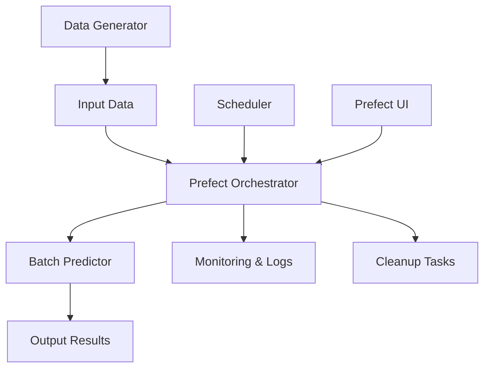

# 🚀 NYC Taxi Batch Prediction System

Sistema enterprise-grade de predicciones por lotes para duración de viajes de taxis NYC usando **Prefect** para orquestación y scheduling automático.

## 🎯 ¿Qué es Batch Deployment?

El **batch deployment** procesa grandes volúmenes de datos de manera programada, a diferencia del web service que responde en tiempo real. Es ideal para:

- **Procesamiento masivo**: Miles de predicciones simultáneas
- **Ejecución programada**: Automático cada X horas/días
- **Recursos optimizados**: Uso eficiente de CPU/memoria
- **Análisis histórico**: Procesar datos acumulados

## 🏗️ Arquitectura del Sistema



### 🔄 Flujo Completo

1. **Generación de Datos**: Simula viajes realistas de taxis NYC
2. **Validación**: Verifica calidad y formato de datos
3. **Procesamiento**: Predicciones ML en paralelo
4. **Almacenamiento**: Guarda resultados organizadamente
5. **Limpieza**: Mantiene el sistema optimizado

### 🎯 Características Principales

- **🔄 Scheduling Automático**: Cada 2 horas via Prefect
- **⚡ Procesamiento Paralelo**: Multi-threading configurable
- **📊 Generación de Datos**: Simulación realista de viajes NYC
- **🧹 Auto Cleanup**: Gestión automática de archivos antiguos
- **📈 Monitoreo**: Métricas de sistema y performance
- **🔒 Gestión de Recursos**: Límites de CPU/Memory
- **📁 Almacenamiento Organizado**: Input/Output/Processed

## 🚀 Guía Completa de Deployment

### **Paso 1: Setup Automático (Recomendado)**

```bash
# Ejecutar script de configuración completa
./scripts/setup_batch_system.sh
```

**¿Qué hace este script?**
- ✅ Verifica Python y UV
- ✅ Instala dependencias
- ✅ Copia modelo ML
- ✅ Crea estructura de directorios
- ✅ Configura variables de entorno
- ✅ Ejecuta tests de validación

### **Paso 2: Setup Manual (Alternativo)**

```bash
# 1. Instalar dependencias
uv sync

# 2. Copiar modelo desde web-service
cp ../web-service/lin_reg.bin .

# 3. Crear estructura de directorios
mkdir -p data/{input,output,processed} logs config

# 4. Crear archivo de configuración
cp .env.example .env  # Editar según necesidades
```

## 🎮 Formas de Ejecutar el Sistema

### **Opción A: Producción con Prefect Server (Recomendado)**

**Terminal 1: Iniciar Servidor Prefect**
```bash
uv run prefect server start --host 0.0.0.0 --port 4200
```

**Terminal 2: Configurar API y Crear Deployments**
```bash
# Configurar URL de API
export PREFECT_API_URL=http://0.0.0.0:4200/api

# Crear deployments automáticos
uv run python scripts/deploy_prefect.py
```

**Terminal 3: Iniciar Worker**
```bash
# Iniciar worker para ejecutar flows
uv run prefect worker start --pool default-agent-pool
```

**Acceder a la UI**: [http://localhost:4200](http://localhost:4200)

### **Opción B: Modo Desarrollo (Local)**

```bash
# Servir flows localmente sin servidor
uv run python scripts/deploy_prefect.py serve
```

### **Opción C: Ejecución Manual (Testing)**

```bash
# 1. Generar datos de prueba
uv run python src/data_generator.py

# 2. Ejecutar predicción por lotes
uv run python src/batch_predictor.py

# 3. Probar flow completo
export PREFECT_API_URL=http://0.0.0.0:4200/api
uv run python -c "
from src.prefect_flows import taxi_batch_prediction_flow
result = taxi_batch_prediction_flow(batch_id='test_manual', use_parallel=False)
print(f'✅ Procesadas {result[\"processing_stats\"][\"num_predictions\"]} predicciones')
"
```

## 📋 Deployments de Prefect Creados

| Deployment | Horario | Descripción | Comando Manual |
|------------|---------|-------------|----------------|
| `taxi-batch-prediction-scheduled` | Cada 2 horas | Procesamiento automático | `prefect deployment run taxi-batch-prediction-scheduled` |
| `taxi-batch-cleanup-scheduled` | Diario 2 AM | Limpieza y mantenimiento | `prefect deployment run taxi-batch-cleanup-scheduled` |
| `taxi-batch-prediction-manual` | Bajo demanda | Ejecución manual | `prefect deployment run taxi-batch-prediction-manual` |

## 🔧 Configuración del Sistema

### **Variables de Entorno** (`.env`)

```bash
# Configuración de Procesamiento
BATCH_SIZE=1000              # Tamaño de lote para procesamiento
MAX_WORKERS=4                # Número de workers paralelos
NUM_TRIPS_PER_BATCH=5000     # Viajes por lote generado
CHUNK_SIZE=100               # Tamaño de chunk para paralelización

# Configuración de Scheduling (formato cron)
BATCH_SCHEDULE_CRON="0 */2 * * *"    # Cada 2 horas
CLEANUP_SCHEDULE_CRON="0 2 * * *"    # Diario a las 2 AM

# Configuración de Prefect
PREFECT_API_URL=http://0.0.0.0:4200/api
PREFECT_WORK_POOL=default-agent-pool

# Retención de Archivos (días)
OUTPUT_RETENTION_DAYS=30     # Mantener outputs 30 días
LOG_RETENTION_DAYS=7         # Mantener logs 7 días

# Límites de Recursos
MEMORY_LIMIT_GB=4.0          # Límite de memoria
CPU_LIMIT_PERCENT=80.0       # Límite de CPU

# Monitoreo
ENABLE_METRICS=true
METRICS_PORT=8000
LOG_LEVEL=INFO
```

### **Configuraciones Clave** (`config/settings.py`)

- **BATCH_SIZE**: Número de predicciones por chunk de procesamiento
- **MAX_WORKERS**: Hilos de procesamiento paralelo (ajustar según CPU)
- **NUM_TRIPS_PER_BATCH**: Cantidad de viajes simulados por lote
- **RETENTION_DAYS**: Políticas de limpieza automática
- **RESOURCE_LIMITS**: Umbrales de CPU/Memory para alertas

## 📊 Flujo de Datos Detallado

### **1. Inputs: Datos de Entrada**

**Formato de Input** (Parquet):
```json
{
    "trip_id": "trip_20250118_143022_000001",
    "batch_timestamp": "2025-01-18T14:30:22",
    "PULocationID": 161,
    "DOLocationID": 236, 
    "trip_distance": 2.5,
    "pickup_datetime": "2025-01-18T14:30:22"
}
```

**Características de los Datos**:
- **PULocationID**: ID de zona de pickup (1-263)
- **DOLocationID**: ID de zona de dropoff (1-263)
- **trip_distance**: Distancia en millas (0.1-50.0)
- **Sesgo Manhattan**: 70% viajes en Manhattan, 30% otros boroughs
- **Distribución realista**: Log-normal para distancias

### **2. Procesamiento: Pipeline ML**

**Feature Engineering**:
```python
# Combinación pickup-dropoff
features['PU_DO'] = f"{PULocationID}_{DOLocationID}"
features['trip_distance'] = trip_distance
```

**Procesamiento Paralelo**:
- **Chunking**: Divide dataset en chunks de 100-1000 registros
- **Multi-threading**: 2-8 workers según CPU disponible
- **DictVectorizer**: Transforma features categóricas
- **LinearRegression**: Modelo pre-entrenado para predicción

### **3. Outputs: Resultados**

**Formato de Output** (Parquet):
```json
{
    "trip_id": "trip_20250118_143022_000001",
    "predicted_duration": 12.34,
    "prediction_timestamp": "2025-01-18T14:35:45",
    "pickup_location": 161,
    "dropoff_location": 236,
    "trip_distance": 2.5,
    "batch_timestamp": "2025-01-18T14:30:22"
}
```

**Ubicación de Archivos**:
- **Input**: `data/input/taxi_batch_YYYYMMDD_HHMMSS.parquet`
- **Output**: `data/output/predictions_BATCH_ID_YYYYMMDD_HHMMSS.parquet`
- **Processed**: `data/processed/processed_BATCH_ID_*.parquet`

**Métricas de Output**:
- **Throughput**: ~2000+ predicciones/segundo
- **Tamaño archivo**: ~1-5 MB por lote (5000 viajes)
- **Formato**: Parquet comprimido para eficiencia

## 📁 Directory Structure

```
batch-deploy/
├── src/
│   ├── data_generator.py      # Data simulation
│   ├── batch_predictor.py     # ML prediction engine
│   └── prefect_flows.py       # Prefect orchestration
├── scripts/
│   ├── setup_batch_system.sh  # Automated setup
│   └── deploy_prefect.py      # Deployment management
├── config/
│   └── settings.py            # Configuration management
├── data/
│   ├── input/                 # Raw batch files
│   ├── output/                # Prediction results
│   └── processed/             # Processed files
├── logs/                      # Application logs
├── pyproject.toml             # Dependencies
└── lin_reg.bin               # ML model
```

## 🎯 Prefect Flow Details

### **Main Flow: `taxi_batch_prediction_flow`**
1. **System Check**: Validate resources (CPU/Memory)
2. **Data Generation**: Create realistic taxi trip data
3. **Data Validation**: Ensure data quality and format
4. **Batch Processing**: Parallel ML predictions
5. **Output Management**: Save results with metadata
6. **File Management**: Move processed files

### **Cleanup Flow: `taxi_batch_cleanup_flow`**
1. **Resource Check**: Monitor system health
2. **File Cleanup**: Remove old files based on retention policy
3. **Space Management**: Free up disk space

## 📈 Performance y Monitoreo

### **Métricas Típicas de Performance**

- **Throughput**: ~2000+ predicciones/segundo
- **Uso de Memoria**: ~2-4 GB para 5000 viajes
- **Tiempo de Procesamiento**: ~3-5 segundos por lote
- **Tamaño de Archivo**: ~1-5 MB por lote (Parquet)
- **Paralelización**: 2-8 workers según CPU disponible

### **Comandos de Monitoreo**

```bash
# Verificar recursos del sistema
uv run python -c "
from src.batch_predictor import BatchPredictor
p = BatchPredictor()
print('📊 Métricas del Sistema:')
metrics = p.get_system_metrics()
for key, value in metrics.items():
    print(f'  {key}: {value}')
"

# Ver logs en tiempo real
tail -f logs/batch_prediction.log

# Verificar archivos generados
ls -la data/output/ | head -10
```

### **Prefect UI - Monitoreo Visual**

- **Dashboard**: [http://localhost:4200](http://localhost:4200)
- **Flow Runs**: Historial de ejecuciones
- **Task Status**: Estado de cada tarea
- **Logs Detallados**: Logs de cada step
- **Métricas**: Performance y recursos

## 🆘 Troubleshooting

### **Common Issues**

#### **Error: "Model file not found"**
```bash
# Copy model from web-service
cp ../web-service/lin_reg.bin .
```

#### **Error: "Prefect server not running"**
```bash
# Start Prefect server
uv run prefect server start --host 0.0.0.0 --port 4200
```

#### **Error: "No worker available"**
```bash
# Start a worker
uv run prefect worker start --pool default-agent-pool
```

#### **Error: "High memory usage"**
```bash
# Reduce batch size in .env
BATCH_SIZE=500
MAX_WORKERS=2
```

### **Performance Tuning**

#### **For Large Datasets (>10K trips)**
```bash
# Increase parallel processing
MAX_WORKERS=8
CHUNK_SIZE=200
```

#### **For Limited Resources**
```bash
# Conservative settings
MAX_WORKERS=2
BATCH_SIZE=500
CHUNK_SIZE=50
```

## 🔍 Monitoring & Observability

### **Prefect UI Features**
- **Flow Runs**: Track execution history
- **Task Status**: Monitor individual task progress
- **Logs**: Detailed execution logs
- **Metrics**: Performance and resource usage
- **Alerts**: Failure notifications

### **Log Locations**
- **Application Logs**: `logs/`
- **Prefect Logs**: Prefect UI
- **System Metrics**: Built-in monitoring

## 🚀 Production Deployment

### **Recommended Setup**
1. **Dedicated Server**: 4+ CPU cores, 8+ GB RAM
2. **Persistent Storage**: For data and logs
3. **Monitoring**: Prefect Cloud or self-hosted UI
4. **Backup Strategy**: Regular model and data backups
5. **Alerting**: Email/Slack notifications for failures

### **Scaling Considerations**
- **Horizontal**: Multiple workers across machines
- **Vertical**: Increase `MAX_WORKERS` and `BATCH_SIZE`
- **Storage**: Use cloud storage for large datasets
- **Database**: PostgreSQL for Prefect metadata

## 📚 Advanced Usage

### **Custom Scheduling**
```python
# Custom cron schedule
BATCH_SCHEDULE_CRON="0 8,12,16,20 * * *"  # 4 times daily
```

### **External Data Sources**
```python
# Modify data_generator.py to read from:
# - Database (PostgreSQL, MySQL)
# - API endpoints
# - Cloud storage (S3, GCS)
# - Message queues (Kafka, RabbitMQ)
```

### **Model Updates**
```bash
# Replace model file
cp new_model.bin lin_reg.bin

# Restart flows to pick up new model
uv run prefect deployment run taxi-batch-prediction-manual
```

## 🎓 Learning Objectives

After completing this exercise, you should understand:

- ✅ **Batch Processing Patterns**: Chunking, parallel processing
- ✅ **Workflow Orchestration**: Prefect flows, tasks, deployments
- ✅ **Production MLOps**: Scheduling, monitoring, maintenance
- ✅ **Resource Management**: CPU/Memory optimization
- ✅ **Data Pipeline Design**: Input → Processing → Output
- ✅ **Error Handling**: Retries, validation, cleanup
- ✅ **Observability**: Logging, metrics, monitoring

## 📞 Support

If you encounter issues:

1. **Check Logs**: Review application and Prefect logs
2. **Verify Setup**: Run `./scripts/setup_batch_system.sh`
3. **Test Components**: Run individual modules
4. **Resource Check**: Monitor CPU/Memory usage
5. **Ask for Help**: Provide specific error messages

---

**🎉 Happy Batch Processing!** This system demonstrates enterprise-grade MLOps practices with automated scheduling, monitoring, and maintenance.
