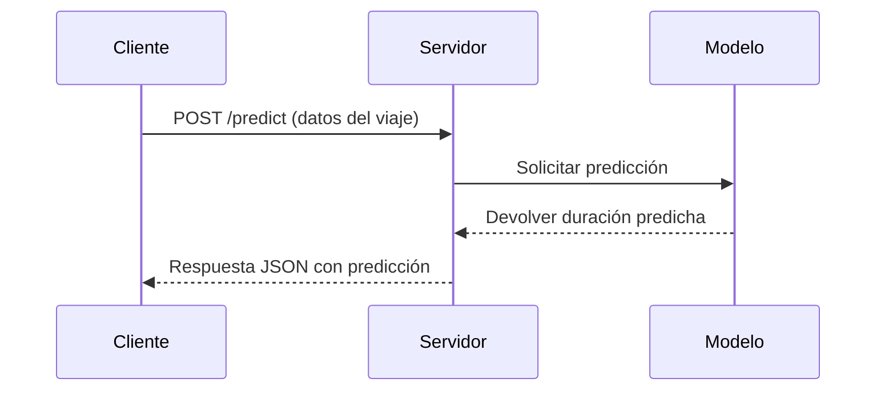

# 🌐 Conceptos de Despliegue de Servicios Web para dummies

Este documento explica los conceptos fundamentales del despliegue de servicios web, utilizando como ejemplo nuestro servicio de predicción de duración de viajes en taxi de NYC.

## 📋 Tabla de Contenidos

- [¿Qué es una API?](#qué-es-una-api)
- [¿Qué es un Servicio Web?](#qué-es-un-servicio-web)
- [¿Qué es un Endpoint?](#qué-es-un-endpoint)
- [¿Qué es un Cliente?](#qué-es-un-cliente)
- [¿Qué es el Protocolo HTTPS?](#qué-es-el-protocolo-https)
- [Arquitectura de Nuestro Servicio](#arquitectura-de-nuestro-servicio)

## 🔌 ¿Qué es una API?

**API** (Interfaz de Programación de Aplicaciones) es un conjunto de reglas y definiciones que permite que diferentes aplicaciones se comuniquen entre sí.

**En términos simples:**

- Es como un "menú" que ofrece un restaurante (servicio)
- Define qué puedes pedir (datos/funciones disponibles)
- Especifica cómo debes hacer tu pedido (formato de solicitud)
- Indica qué recibirás a cambio (formato de respuesta)

**En nuestro servicio de taxi:**

- La API permite que aplicaciones externas soliciten predicciones de duración de viajes
- Define el formato exacto para enviar datos del viaje (origen, destino, distancia)
- Especifica cómo se devolverán las predicciones


## 🌐 ¿Qué es un Servicio Web?

**Un Servicio Web** es una aplicación que:

- Se ejecuta en un servidor
- Es accesible a través de Internet
- Utiliza protocolos estándar como HTTP
- Proporciona funcionalidades a otras aplicaciones

**Características principales:**

- **Accesibilidad**: Disponible a través de la red
- **Interoperabilidad**: Funciona con diferentes plataformas
- **Escalabilidad**: Puede manejar múltiples solicitudes
- **Independencia**: No importa qué lenguaje use el cliente

**Nuestro servicio web de predicción:**

- Se ejecuta en un servidor (localhost:9696)
- Proporciona predicciones de duración de viajes
- Es accesible mediante solicitudes HTTP
- Responde con datos en formato JSON


## 🎯 ¿Qué es un Endpoint?

**Un Endpoint** es un punto específico de conexión en una API donde se pueden enviar solicitudes para acceder a un recurso o funcionalidad particular.

**En términos simples:**

- Es como una "ventanilla" específica en un banco
- Cada ventanilla (endpoint) tiene una función específica
- Tiene su propia dirección (URL)
- Acepta ciertos tipos de solicitudes (GET, POST, etc.)

**En nuestro servicio de taxi:**

- `/predict`: Endpoint para obtener predicciones (acepta POST)
- `/health`: Endpoint para verificar el estado del servicio (acepta GET)

## 👤 ¿Qué es un Cliente?

**Un Cliente** es cualquier aplicación o sistema que consume un servicio web mediante el envío de solicitudes a sus endpoints.

**Tipos de clientes:**

- **Navegadores web**: Chrome, Firefox, Safari
- **Aplicaciones móviles**: Apps en smartphones
- **Otros servicios**: Sistemas que se conectan entre sí
- **Scripts**: Programas que hacen solicitudes automáticas

**En nuestro caso:**

- El archivo `test.py` actúa como cliente
- Envía solicitudes al servicio de predicción
- Procesa las respuestas recibidas

## 🔒 ¿Qué es el Protocolo HTTPS?

**HTTPS** (HTTP Seguro) es un protocolo de comunicación que permite la transferencia segura de datos en la web.

**Características principales:**

- **Cifrado**: Protege los datos durante la transmisión
- **Autenticación**: Verifica la identidad del servidor
- **Integridad**: Garantiza que los datos no sean modificados

**¿Por qué es importante?**

- Protege información sensible (contraseñas, datos personales)
- Previene ataques de intermediarios
- Genera confianza en los usuarios
- Es un estándar para servicios profesionales

## 🏗️ Arquitectura de Nuestro Servicio

Nuestro servicio de predicción de duración de viajes en taxi sigue una arquitectura cliente-servidor típica:

### Componentes Principales:

1. **Servidor (predict.py)**:

   - Carga el modelo de ML entrenado
   - Expone endpoints para predicciones
   - Procesa solicitudes y genera respuestas
2. **Cliente (test.py)**:

   - Envía datos de viajes al servidor
   - Recibe predicciones de duración
   - Muestra resultados al usuario
3. **Modelo ML (lin_reg.bin)**:

   - Contiene el modelo entrenado
   - Realiza predicciones basadas en características del viaje

### Flujo de Comunicación:



### Visualización de la Arquitectura:

## 🚀 Ejemplo Práctico

### 1. El cliente envía una solicitud:

```bash
curl -X POST http://localhost:9696/predict \
  -H "Content-Type: application/json" \
  -d '{"PULocationID": 161, "DOLocationID": 236, "trip_distance": 2.5}'
```

### 2. El servidor recibe la solicitud:

- Valida los datos de entrada
- Prepara las características para el modelo
- Solicita una predicción al modelo

### 3. El modelo hace la predicción:

- Utiliza los datos procesados
- Aplica el algoritmo de regresión
- Calcula la duración estimada

### 4. El servidor envía la respuesta:

```json
{
  "duration": 12.34,
  "pickup_location": 161,
  "dropoff_location": 236,
  "trip_distance": 2.5
}
```

## 📚 Glosario de Términos

- **API**: Interfaz de Programación de Aplicaciones
- **REST**: Transferencia de Estado Representacional (estilo de arquitectura)
- **JSON**: Notación de Objetos de JavaScript (formato de datos)
- **HTTP**: Protocolo de Transferencia de Hipertexto
- **HTTPS**: HTTP Seguro
- **Endpoint**: Punto de acceso específico en una API
- **Request**: Solicitud enviada al servidor
- **Response**: Respuesta enviada por el servidor
- **Cliente**: Aplicación que consume un servicio
- **Servidor**: Sistema que proporciona un servicio

## 🔍 Para Aprender Más

- [¿Qué es una API? (Video)](https://www.youtube.com/watch?v=s7wmiS2mSXY)
- [Introducción a REST API](https://www.redhat.com/es/topics/api/what-is-a-rest-api)
- [Guía sobre HTTPS](https://developers.google.com/web/fundamentals/security/encrypt-in-transit/why-https)
- [Conceptos básicos de servicios web](https://www.ibm.com/docs/es/was-nd/8.5.5?topic=services-web-service-concepts)
- [Vídeo: qué son y cómo funcionan los micro-servicios](https://www.youtube.com/watch?v=2sFczigWppk)
